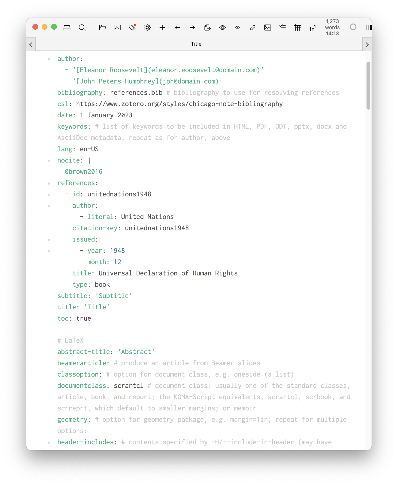
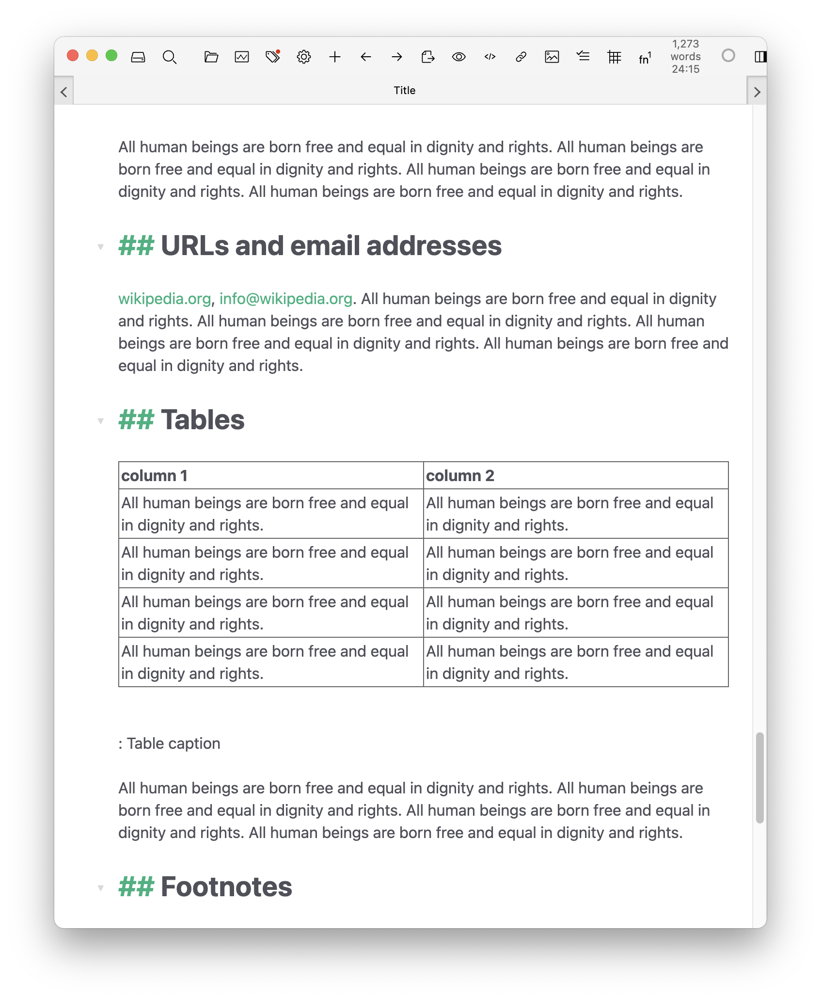
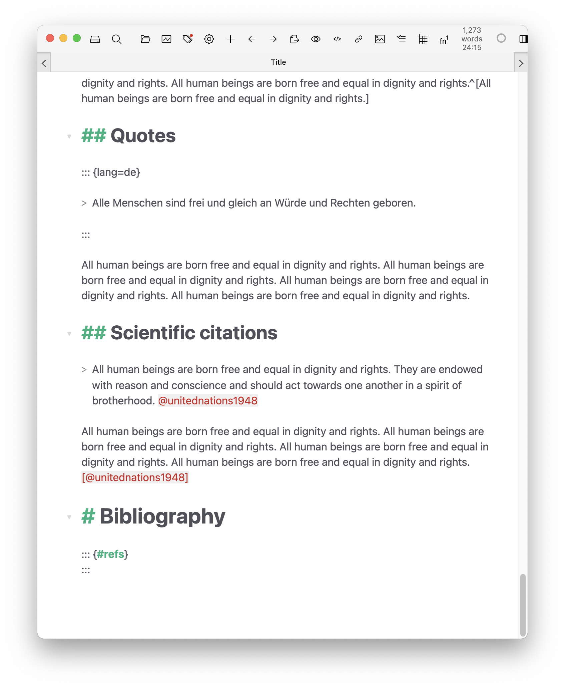
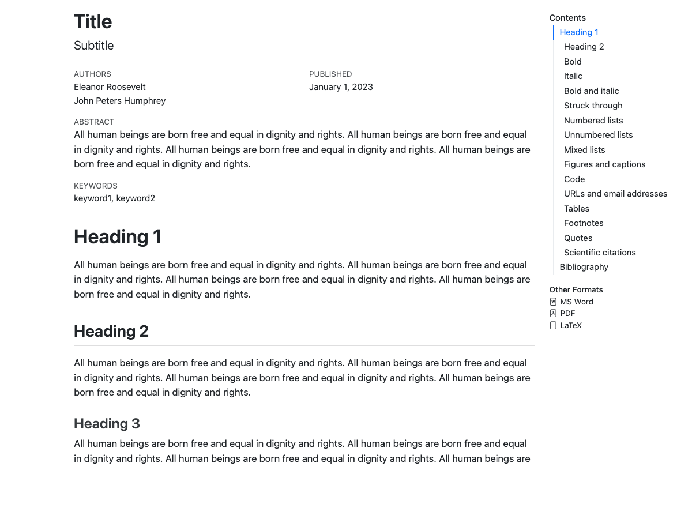
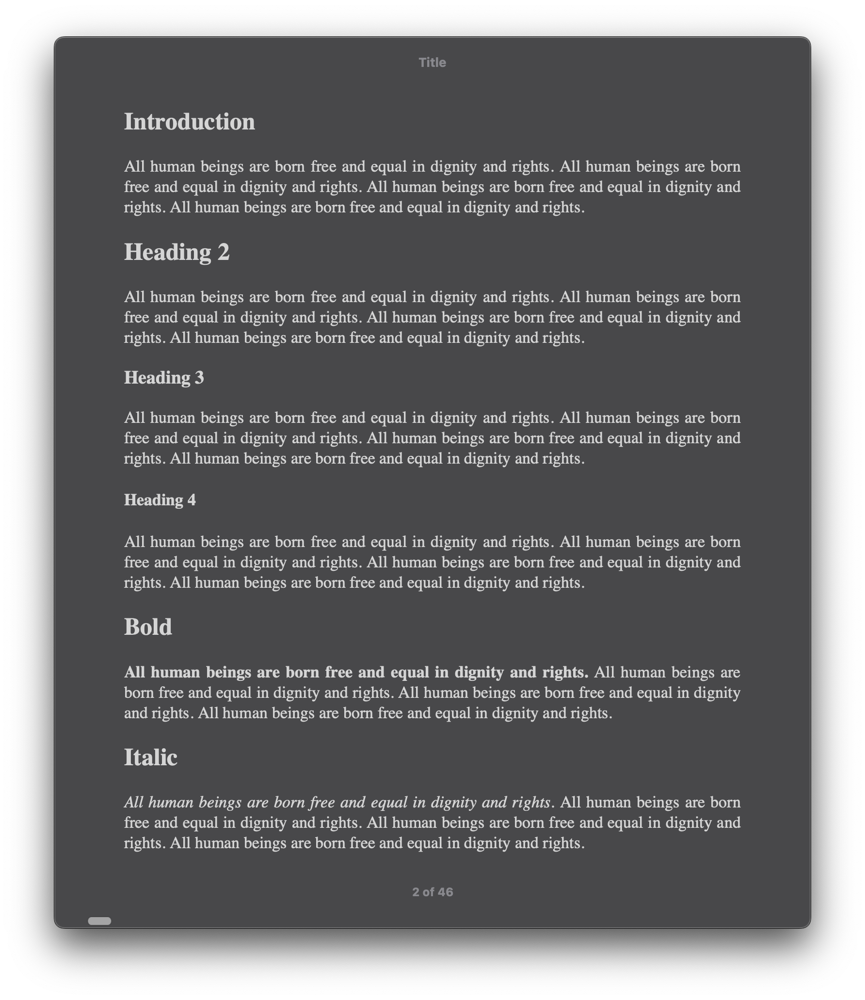
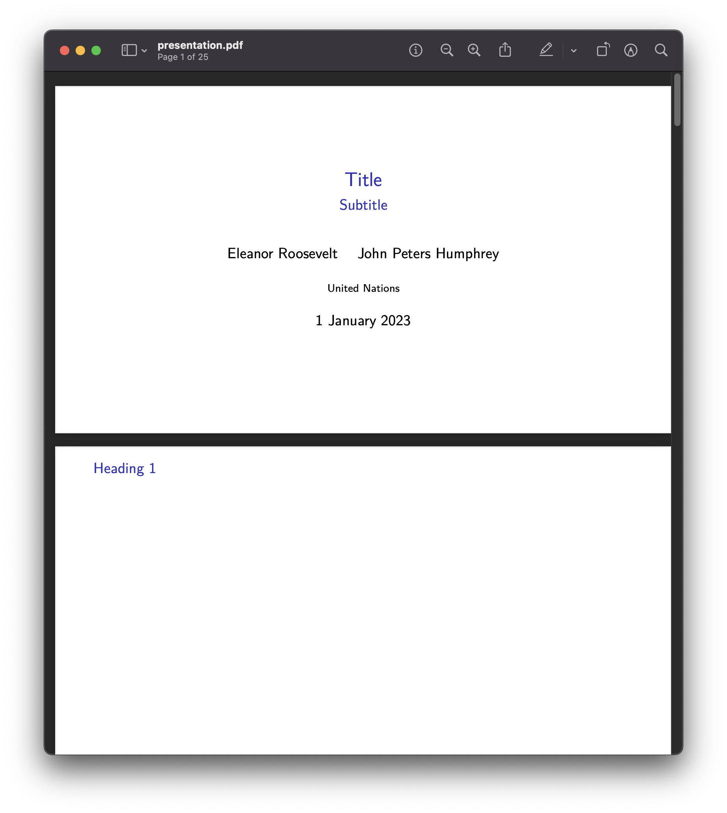
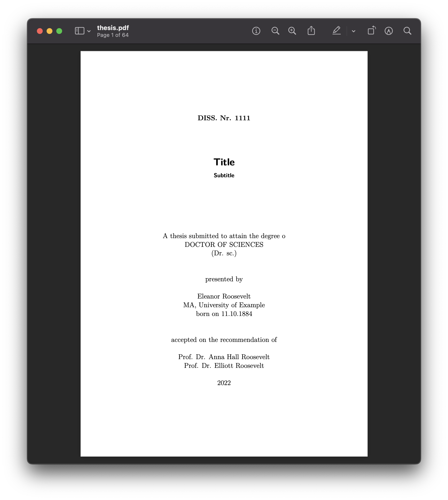

# Academic Pandoc template

[Quarto](https://quarto.org/) templates for academic articles, presentations, and theses. The repository keeps editable sources and rendered outputs together so users can write in plain text and still commit PDFs, Word files, slide decks, and TeX output.

[](https://github.com/maehr/academic-pandoc-template/issues)
[](https://github.com/maehr/academic-pandoc-template/network)
[](https://github.com/maehr/academic-pandoc-template/stargazers)
[](https://github.com/maehr/academic-pandoc-template/blob/main/LICENSE.md)
[](https://zenodo.org/badge/latestdoi/139726344)

<!-- prettier-ignore -->
| source | article | presentation | thesis |
| :--- | :-----: | :-----: | :-----: |
| edit | [](article/article.md) | [](presentation/presentation.md) | [](thesis/index.qmd) |
| html | [](article/article.html) | [](presentation/presentation.html) | |
| docx | [](article/article.docx) | | [](thesis/thesis.docx) |
| epub | | | [](thesis/thesis.epub) |
| pdf | [](article/article.pdf) | [](presentation/presentation.pdf) | [](thesis/thesis.pdf) |
| pptx | | [](presentation/presentation.pptx) | |
| tex | [](article/article.tex) | [](presentation/presentation.tex) | [](thesis/thesis.tex) |

## Getting Started

You can use this template entirely on GitHub, or build the documents locally if you are comfortable installing tools.

### Use The Template On GitHub

1. Click [Use this template](https://github.com/maehr/academic-pandoc-template/generate) to create your own copy of this repository. You can also [fork this repository](https://docs.github.com/en/get-started/quickstart/fork-a-repo).
2. Edit the document you want to write:
   - Article: [article/article.md](article/article.md)
   - Presentation: [presentation/presentation.md](presentation/presentation.md)
   - Thesis: files in [thesis/](thesis), starting with [thesis/index.qmd](thesis/index.qmd)
3. Edit titles, authors, dates, and other document settings in the matching `_metadata.yml` file:
   - Article: [article/\_metadata.yml](article/_metadata.yml)
   - Presentation: [presentation/\_metadata.yml](presentation/_metadata.yml)
   - Thesis: [thesis/\_metadata.yml](thesis/_metadata.yml)
4. Edit references in the matching `references.bib` file:
   - Article: [article/references.bib](article/references.bib)
   - Presentation: [presentation/references.bib](presentation/references.bib)
   - Thesis: [thesis/references.bib](thesis/references.bib)
5. [Commit your changes](https://docs.github.com/en/desktop/contributing-and-collaborating-using-github-desktop/making-changes-in-a-branch/committing-and-reviewing-changes-to-your-project).
6. Open the repository's [Actions](https://github.com/maehr/academic-pandoc-template/actions) tab, select the [Quarto workflow](https://github.com/maehr/academic-pandoc-template/actions/workflows/quarto.yml), and click **Run workflow**.
7. When the workflow finishes, the rendered files such as PDF, Word, HTML, EPUB, PowerPoint, and TeX are committed back to the repository.

You can edit Markdown files [online on GitHub](https://docs.github.com/en/github/managing-files-in-a-repository/managing-files-on-github/editing-files-in-your-repository), with [Zettlr](https://www.zettlr.com/), or with another [Markdown editor](https://www.markdownguide.org/tools/). If you are new to Markdown, start with [The Markdown Guide](https://www.markdownguide.org/). You can edit BibTeX references online, with [JabRef](http://www.jabref.org/), or with your favorite BibTeX editor.

### Build Locally

Use this template, edit one of the document sources, and run the Quarto build. The npm scripts render the root documentation site and each document-specific Quarto project.

#### Prerequisites

- [Quarto](https://quarto.org/docs/get-started/)
- [TinyTeX](https://yihui.org/tinytex/) for PDF output: `quarto install tinytex`
- [Node.js](https://nodejs.org/) and npm for formatting, rendering, and changelog tooling

#### Build

```bash
npm run render
```

Preview the documentation site locally:

```bash
npm run preview
```

Document-specific previews are available with `npm run preview:article`, `npm run preview:presentation`, and `npm run preview:thesis`.

Useful render scripts:

- `npm run render:article` renders all article formats.
- `npm run render:presentation` renders RevealJS, Beamer PDF, PowerPoint, and TeX outputs.
- `npm run render:thesis` renders Word, EPUB, PDF, and TeX thesis outputs.
- `npm run render:article:pdf`, `npm run render:presentation:pptx`, or `npm run render:thesis:docx` render a single format.

You can also call Quarto directly:

```bash
quarto render
quarto render article --to pdf
```

## Structure

- `_quarto.yml` defines the root Quarto documentation website.
- `_brand.yml` defines shared branding metadata for the documentation website.
- `article/_quarto.yml`, `presentation/_quarto.yml`, and `thesis/_quarto.yml` define the render targets for each document type.
- `article/_metadata.yml`, `presentation/_metadata.yml`, and `thesis/_metadata.yml` hold document metadata.
- `article/index.qmd` is an ordinary Quarto document entrypoint that includes `article.md`.
- `presentation/index.qmd` renders `presentation.md` to RevealJS, Beamer, PowerPoint, and TeX.
- `thesis/index.qmd` includes chapter files such as `00_Introduction.md` and keeps separate bibliographies for sources and literature.
- `assets/csl/` contains citation styles shared by the examples.

## Configuration

Edit the relevant `_metadata.yml` file to change titles, authors, and bibliographies. Render targets and format options belong in the document-specific `_quarto.yml` files.

Quarto-native cross-reference labels use hyphens:

```markdown
{#fig-example}

See @fig-example.
```

## Linting And Formatting

Install dependencies:

```bash
npm install
```

Check or format files:

```bash
npm run check
npm run format
```

## Continuous Integration

The `Quarto` workflow installs npm dependencies, Quarto, and TinyTeX, runs formatting checks, renders all documents with `npm run render`, and commits updated artifacts back to the repository when manually triggered.

## Built With

- [Quarto](https://quarto.org/)
- [TinyTeX](https://yihui.org/tinytex/)
- [Prettier](https://prettier.io/)
- [commitizen](https://github.com/commitizen/cz-cli)
- [git-cliff](https://github.com/orhun/git-cliff)
- [husky](https://github.com/typicode/husky)

## Contributing

Please read [CONTRIBUTING.md](CONTRIBUTING.md) for details on the code of conduct and pull request process.

## License

This project is licensed under the MIT License. See [LICENSE.md](LICENSE.md) for details.

## Acknowledgments

- Sarah Simpkin, "Getting Started with Markdown," _Programming Historian_ 4 (2015), [https://doi.org/10.46430/phen0046](https://doi.org/10.46430/phen0046).
- Dennis Tenen and Grant Wythoff, "Sustainable Authorship in Plain Text using Pandoc and Markdown," _Programming Historian_ 3 (2014), [https://doi.org/10.46430/phen0041](https://doi.org/10.46430/phen0041).
